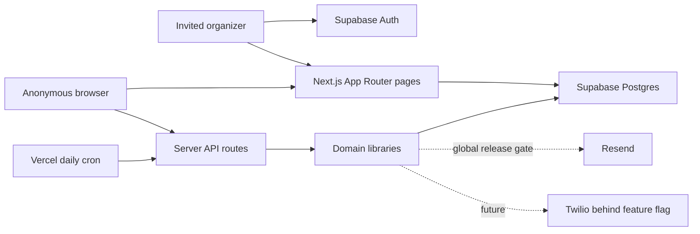

# Project architecture

This document is the repository-owned summary of the deployed system. Feature delivery updates it whenever runtime boundaries, data flows, security assumptions, providers, or operational behavior change.

## Product boundary

Mishnayot Signup is a Hebrew-first, multi-campaign memorial board. Learners claim tractates anonymously. One Next.js deployment hosts campaigns at `/<slug>`. Invited organizers authenticate to a separate campaign-scoped admin interface; campaign creation remains a controlled SQL operation.

## Runtime topology

The application is intentionally a modular monolith on Vercel:

- `app/` owns routes, server data loading, and page composition.
- `components/ds/` owns React Aria/Tailwind primitives.
- `components/<feature>/` owns stateful or domain-specific composites.
- `lib/` owns domain logic, validation, provider adapters, and server helpers.
- `app/api/` is the browser/provider boundary.
- Supabase Postgres is the only persistent store.

## Trust boundaries

- Browsers never receive `SUPABASE_SERVICE_ROLE_KEY`.
- Public state APIs explicitly select board-safe fields and exclude reminder contacts/tokens.
- Postgres RLS is enabled with no anon policies; server routes use the service role.
- Cron requires `Authorization: Bearer $CRON_SECRET`.
- Twilio callbacks require signature verification.
- Reminder management links are high-entropy bearer capabilities.
- Claim editing uses a separate 256-bit bearer capability in a 15-minute HttpOnly cookie; only its hash is stored and Postgres enforces expiry.
- Organizer sessions use Supabase Auth. Every admin loader and mutation verifies the user plus `(user_id, campaign_id)` membership before service-role access.

## Core flows

### Campaign board

`/[slug]` loads campaign metadata server-side. The client polls the public state API for tractate availability and claimant display names.

### Claim

The claim form uses shared Zod validation. `POST /api/campaigns/[slug]/claim` resolves the campaign and calls the atomic `claim_tractate` Postgres function, preventing double claims and orphan reminder inserts. A successful claim stores a capability hash and sets a short-lived HttpOnly cookie. Public state projects edit permission only to the matching browser; claimant rename/release is revalidated transactionally.

### Reminders

Reminder infrastructure is retained but globally unavailable in the current release. `ENABLE_EMAIL_REMINDERS` must be exactly `true` and valid Resend key/sender values must exist before the claim UI exposes reminders, the claim API accepts enrollment, or the reminder job queries rows and calls providers. Production keeps the flag false for the Biala launch. This fail-closed server gate is independent of UI hiding.

When deliberately enabled in a future reminder release, the daily Vercel cron invokes the shared job, which evaluates cadence and records provider sends in `reminder_sends`. Resend is the email adapter. Voice remains separately disabled unless explicitly feature-enabled and is not production-ready until precise scheduling exists.

### Administration

`/admin` uses invite-only Supabase magic links with automatic user creation disabled. `campaign_memberships` scopes each organizer. Authorized organizers can edit campaign display content and rename/release claimed tractates; admin queries never select reminders or contact data. Invitations, membership assignment, campaign creation, and binary image upload remain operator-managed.

## Data model

- `campaigns` — campaign content, slug, theme, deadline, timezone, active state.
- `tractates` — the 64 campaign slots, claimant display name, claim timestamp, claimant capability hash.
- `campaign_memberships` — organizer-to-campaign authorization.
- `reminders` — private contact, cadence, locale, channel flags, management token.
- `reminder_sends` — per-channel, per-period idempotency/audit records.

Live data changes use additive migrations. `supabase/schema.sql` is destructive and only for a new/reset database. `migrate-theme-deadline.sql` must never run after `migrate-reminders.sql`.

## Feature catalog

- Multi-campaign slug routing
- Public tractate board and atomic anonymous claiming
- Campaign themes, photos, display deadlines, and progress
- Dormant email reminder infrastructure behind a global fail-closed release gate
- Accountless 15-minute claimant rename/release capability
- Invite-only, campaign-scoped organizer administration
- Feature-gated Twilio adapter (not exposed in Phase 1)

Feature specifications and delivery records live under `docs/features/`. See `docs/features/claimant-organizer-access/` for the access-control delivery record, `docs/features/biala-campaign-launch/` for the first globally reminder-disabled campaign release, and `docs/architecture/decisions/0001-organizer-and-claimant-access.md` for the access architecture decision.

## Quality and operations

- Vitest covers domain and mocked API behavior.
- Playwright covers campaign, claim, validation, administration, reminder management, and mobile modal behavior.
- GitHub Actions runs tests/build; browser tests run on main/nightly.
- Mutation testing and feature traceability are defined by `docs/engineering/feature-workflow.md`.
- Production email enablement requires Supabase migration verification, Resend configuration, cron smoke testing, and failure monitoring.

## Known architectural priorities

1. Reserve reminder-send records before provider calls to prevent overlapping-run duplicates.
2. Replace hand-ordered schema copies with tracked additive migrations.
3. Add rate limiting, structured observability, and provider-volume controls.
4. Add organizer invitation/role management, campaign creation, and binary photo upload.
5. Decompose the large campaign client into feature composites as it evolves.

## Decision records

Create an ADR under `docs/architecture/decisions/` for changes to authentication, tenant authorization, payment architecture, reminder scheduling, data retention, or deployment topology.
